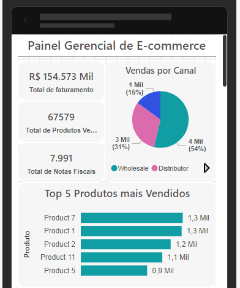

# Painel de Gerenciamento de E-commerce

Este projeto em Power BI apresenta um painel analítico completo para gerenciar e monitorar as operações de um e-commerce, oferecendo insights estratégicos para melhorar o desempenho nas áreas de vendas, faturamento e relacionamento com clientes. 

## Visão Geral

### Visão Desktop
A interface principal do painel, projetada para visualização em telas maiores.

### Visão Mobile
Versão adaptada para dispositivos móveis, garantindo usabilidade e acesso fácil aos principais indicadores.

O **Painel de Gerenciamento de E-commerce** foi desenvolvido para fornecer uma visão unificada dos principais indicadores de performance (KPIs) do e-commerce, visando a otimização de estratégias de vendas e a maximização do faturamento. Com uma interface visual e intuitiva, este painel auxilia na análise de dados de maneira prática e eficiente, permitindo decisões mais informadas e baseadas em dados.

## Pontos e Benefícios do Projeto

- **Centralização de Informações**: Todos os dados relevantes estão disponíveis em um único painel, facilitando o acesso rápido a informações importantes e a identificação de tendências.
- **Insights para Estratégia Comercial**: A análise detalhada dos canais de vendas, clientes e produtos possibilita que a equipe comercial desenvolva estratégias de vendas mais focadas.
- **Monitoramento do Desempenho ao Longo do Tempo**: Com a análise de faturamento ao longo do tempo e uma previsão para os próximos três meses, o painel oferece um panorama temporal das vendas, fundamental para o planejamento e controle.
- **Identificação de Oportunidades**: O painel identifica os principais clientes, cidades e produtos, ajudando a direcionar esforços para áreas que contribuem significativamente para o faturamento.
- **Otimização da Gestão de Produtos e Canais de Vendas**: A visualização dos produtos mais vendidos e os canais de vendas mais eficientes auxilia a equipe de gestão a otimizar estoques e campanhas de marketing.

## Principais Análises Realizadas

1. **Vendas por Canal**:
   - Análise das vendas de acordo com o canal, permitindo avaliar quais canais são mais rentáveis.
2. **Total de Faturamento**:
   - Monitoramento do faturamento total para análise de crescimento e lucratividade.
3. **Total de Produtos Vendidos**:
   - Quantificação dos produtos vendidos para entender o volume de vendas.
4. **Total de Notas Fiscais**:
   - Contagem de notas fiscais emitidas, oferecendo uma visão do número de transações.
5. **Top 5 Clientes por Faturamento**:
   - Identificação dos principais clientes em termos de faturamento, possibilitando o fortalecimento de parcerias.
6. **Top 5 Cidades por Faturamento**:
   - Determinação das principais cidades para vendas, auxiliando na alocação de campanhas e logística.
7. **Top 5 Produtos Mais Vendidos**:
   - Listagem dos produtos com maior demanda, ajudando na otimização de estoques e estratégias de marketing.
8. **Faturamento ao Longo do Tempo e Previsão para os Próximos 3 Meses**:
    - Análise temporal do faturamento com uma projeção para os três meses seguintes, apoiando o planejamento estratégico.

## Tecnologias Utilizadas

- **Power BI**: Ferramenta principal para visualização de dados e criação do painel.
- **Excel/CSV**: Utilizado para armazenamento e manipulação inicial dos dados.
- **DAX (Data Analysis Expressions)**: Linguagem usada no Power BI para criação de cálculos e medidas complexas.

## Resultados e Insights

O **Painel de Gerenciamento de E-commerce** proporciona uma visão estratégica e operacional do desempenho do e-commerce, permitindo que os gestores acompanhem KPIs em tempo real e façam ajustes rápidos nas estratégias de marketing, logística e gestão de estoque. A identificação de clientes e produtos mais rentáveis, além da análise das previsões de vendas, permite uma maior precisão no planejamento e execução de ações futuras.

## Considerações Finais

Este painel em Power BI é uma poderosa ferramenta para qualquer e-commerce que busca tomar decisões baseadas em dados. Com insights claros e uma interface intuitiva, ele se torna essencial para o monitoramento das operações e a criação de estratégias que maximizem o faturamento e a satisfação dos clientes. 

---

 
  
   

